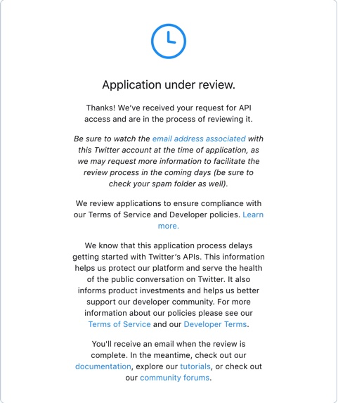
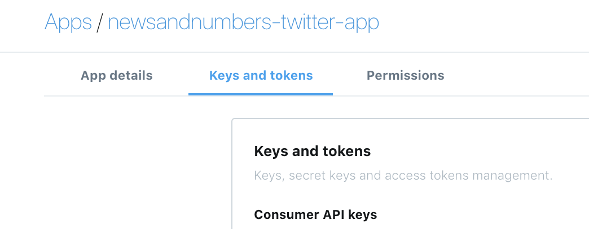

rtweet setup (as of 2018-11-14)
================
Martin Frigaard

# Setting up `rtweet` with Twitter

There’s a new process for getting data from Twitter with `rtweet`, so I
put this document together as a guide for users looking for help in
setting up the API, creating the tokens, and getting the data.

## Load the packages

Install/load the packages

``` r
# packages ------
# install.packages("rtweet")
# devtools::install_github("mkearney/rtweet")
library(rtweet)
library(httr)
library(tidyverse)
```

    ## ── Attaching packages ─────────────────────────────── tidyverse 1.2.1 ──

    ## ✔ ggplot2 3.1.0     ✔ purrr   0.2.5
    ## ✔ tibble  1.4.2     ✔ dplyr   0.7.8
    ## ✔ tidyr   0.8.2     ✔ stringr 1.3.1
    ## ✔ readr   1.1.1     ✔ forcats 0.3.0

    ## ── Conflicts ────────────────────────────────── tidyverse_conflicts() ──
    ## ✖ dplyr::filter()  masks stats::filter()
    ## ✖ purrr::flatten() masks rtweet::flatten()
    ## ✖ dplyr::lag()     masks stats::lag()

## Apply for an API

The major change is a new application process for getting your Twitter
API. This involves answering some basic questions about how you’ll be
using the data, and how you’ll be interacting with likes, retweets,
followers, etc. These are the topics I needed to address.

> 1.  The core use case, intent, or business purpose for your use of the
>     Twitter APIs
> 2.  If you intend to analyze Tweets, Twitter users, or their content,
>     share details about the analyses you plan to conduct and the
>     methods or techniques
> 3.  If your use involves Tweeting, Retweeting, or liking content,
>     share how you will interact with Twitter users or their content
> 4.  If you’ll display Twitter content off of Twitter, explain how and
>     where Tweets and Twitter content will be displayed to users of
>     your product or service, including whether Tweets and Twitter
>     content will be displayed at row level or aggregated

After you submit your application, the review is pretty quick (24 hours
in my case)

<!-- -->

*An actual human likely reviews the applications, because I was sent an
addtitional email requesting that I expand on a particular item.*

## Set up your twitter app

After getting approved, you’ll see the following in your Twitter
developer dashboard:

<!-- -->

Fill out the name and description fields, and the website url is a
twitter account.

### Callback url

The callback url I used is from the [`rtweet` info
page](https://rtweet.info/).

<!-- -->

### Create the `appname`

Assign your twitter app name to `appname`.

<!-- -->

``` r
## app name from api set-up
appname <- "newsandnumbers-twitter-app"
```

Now create the **Consumer API** `key` and the **Consumer API** `secret`
key from the **Keys and Tokens** tab on the Twitter development
dashboard.

``` r
key <- "jibberish"

secret <- "jibberishjibberishjibberishjibberishjibberish"
```

<!-- -->

### 2a. Authenticate via web browser (interactive)

Now you can create a `twitter_token`.

``` r
# create token named "twitter_token"
twitter_token <- rtweet::create_token(app = appname,
                                    consumer_key = key,
                                    consumer_secret = secret)
```

This will take you into the browser and you’ll see this

<!-- -->

Click **Authorize app** and close the browser tab.

## Save `twitter_token` in your home directory

Put your `twitter_token` somewhere safe, like your home directory.

``` r
## path of home directory 
home_directory <- path.expand("~")
## combine with name for token
file_name <- file.path(home_directory,
                       "twitter_token.rds")
## save token to home directory
saveRDS(twitter_token, file = file_name)
```

You can also add the `twitter_token` to your `".Renviron"` variable.

``` r
## assuming you followed the procodures to create "file_name"
## from the previous code chunk, then the code below should
## create and save your environment variable.
cat(paste0("TWITTER_PAT=", file_name),
    file = file.path(home_directory, ".Renviron"),
    append = TRUE)
```

# Collect some twitter data

Now to test this new API, we’ll use the examples from the vignette
[`rtweet: Collecting Twitter
Data`](https://rtweet.info/articles/intro.html)

``` r
## search for 18000 tweets using the rstats hashtag
rt <- rtweet::search_tweets(
  "#rstats", n = 18000, include_rts = FALSE
)
```

``` r
## preview tweets data
rt %>% dplyr::glimpse(78)
```

    ## Observations: 3,270
    ## Variables: 88
    ## $ user_id                 <chr> "1270025862", "1270025862", "1270025862",...
    ## $ status_id               <chr> "1062835275360059393", "10621355682204631...
    ## $ created_at              <dttm> 2018-11-14 22:30:50, 2018-11-13 00:10:27...
    ## $ screen_name             <chr> "DataScientistsF", "DataScientistsF", "Da...
    ## $ text                    <chr> "A Mathematician’s Perspective on Topolog...
    ## $ source                  <chr> "IFTTT", "IFTTT", "IFTTT", "IFTTT", "IFTT...
    ## $ display_text_width      <dbl> 96, 94, 88, 79, 78, 101, 70, 98, 83, 51, ...
    ## $ reply_to_status_id      <chr> NA, NA, NA, NA, NA, NA, NA, NA, NA, NA, N...
    ## $ reply_to_user_id        <chr> NA, NA, NA, NA, NA, NA, NA, NA, NA, NA, N...
    ## $ reply_to_screen_name    <chr> NA, NA, NA, NA, NA, NA, NA, NA, NA, NA, N...
    ## $ is_quote                <lgl> FALSE, FALSE, FALSE, FALSE, FALSE, FALSE,...
    ## $ is_retweet              <lgl> FALSE, FALSE, FALSE, FALSE, FALSE, FALSE,...
    ## $ favorite_count          <int> 0, 0, 0, 0, 0, 0, 0, 0, 0, 0, 0, 2, 1, 0,...
    ## $ retweet_count           <int> 0, 1, 2, 1, 1, 0, 1, 1, 1, 1, 1, 2, 2, 0,...
    ## $ hashtags                <list> ["rstats", "rstats", "rstats", "rstats",...
    ## $ symbols                 <list> [NA, NA, NA, NA, NA, NA, NA, NA, NA, NA,...
    ## $ urls_url                <list> ["ift.tt/2qUpgvH", "ift.tt/2JXerlb", "if...
    ## $ urls_t.co               <list> ["https://t.co/bXjWqB68G3", "https://t.c...
    ## $ urls_expanded_url       <list> ["https://ift.tt/2qUpgvH", "https://ift....
    ## $ media_url               <list> [NA, NA, NA, NA, NA, NA, NA, NA, NA, NA,...
    ## $ media_t.co              <list> [NA, NA, NA, NA, NA, NA, NA, NA, NA, NA,...
    ## $ media_expanded_url      <list> [NA, NA, NA, NA, NA, NA, NA, NA, NA, NA,...
    ## $ media_type              <list> [NA, NA, NA, NA, NA, NA, NA, NA, NA, NA,...
    ## $ ext_media_url           <list> [NA, NA, NA, NA, NA, NA, NA, NA, NA, NA,...
    ## $ ext_media_t.co          <list> [NA, NA, NA, NA, NA, NA, NA, NA, NA, NA,...
    ## $ ext_media_expanded_url  <list> [NA, NA, NA, NA, NA, NA, NA, NA, NA, NA,...
    ## $ ext_media_type          <chr> NA, NA, NA, NA, NA, NA, NA, NA, NA, NA, N...
    ## $ mentions_user_id        <list> [NA, NA, NA, NA, NA, NA, NA, NA, NA, NA,...
    ## $ mentions_screen_name    <list> [NA, NA, NA, NA, NA, NA, NA, NA, NA, NA,...
    ## $ lang                    <chr> "en", "en", "en", "en", "en", "en", "en",...
    ## $ quoted_status_id        <chr> NA, NA, NA, NA, NA, NA, NA, NA, NA, NA, N...
    ## $ quoted_text             <chr> NA, NA, NA, NA, NA, NA, NA, NA, NA, NA, N...
    ## $ quoted_created_at       <dttm> NA, NA, NA, NA, NA, NA, NA, NA, NA, NA, ...
    ## $ quoted_source           <chr> NA, NA, NA, NA, NA, NA, NA, NA, NA, NA, N...
    ## $ quoted_favorite_count   <int> NA, NA, NA, NA, NA, NA, NA, NA, NA, NA, N...
    ## $ quoted_retweet_count    <int> NA, NA, NA, NA, NA, NA, NA, NA, NA, NA, N...
    ## $ quoted_user_id          <chr> NA, NA, NA, NA, NA, NA, NA, NA, NA, NA, N...
    ## $ quoted_screen_name      <chr> NA, NA, NA, NA, NA, NA, NA, NA, NA, NA, N...
    ## $ quoted_name             <chr> NA, NA, NA, NA, NA, NA, NA, NA, NA, NA, N...
    ## $ quoted_followers_count  <int> NA, NA, NA, NA, NA, NA, NA, NA, NA, NA, N...
    ## $ quoted_friends_count    <int> NA, NA, NA, NA, NA, NA, NA, NA, NA, NA, N...
    ## $ quoted_statuses_count   <int> NA, NA, NA, NA, NA, NA, NA, NA, NA, NA, N...
    ## $ quoted_location         <chr> NA, NA, NA, NA, NA, NA, NA, NA, NA, NA, N...
    ## $ quoted_description      <chr> NA, NA, NA, NA, NA, NA, NA, NA, NA, NA, N...
    ## $ quoted_verified         <lgl> NA, NA, NA, NA, NA, NA, NA, NA, NA, NA, N...
    ## $ retweet_status_id       <chr> NA, NA, NA, NA, NA, NA, NA, NA, NA, NA, N...
    ## $ retweet_text            <chr> NA, NA, NA, NA, NA, NA, NA, NA, NA, NA, N...
    ## $ retweet_created_at      <dttm> NA, NA, NA, NA, NA, NA, NA, NA, NA, NA, ...
    ## $ retweet_source          <chr> NA, NA, NA, NA, NA, NA, NA, NA, NA, NA, N...
    ## $ retweet_favorite_count  <int> NA, NA, NA, NA, NA, NA, NA, NA, NA, NA, N...
    ## $ retweet_retweet_count   <int> NA, NA, NA, NA, NA, NA, NA, NA, NA, NA, N...
    ## $ retweet_user_id         <chr> NA, NA, NA, NA, NA, NA, NA, NA, NA, NA, N...
    ## $ retweet_screen_name     <chr> NA, NA, NA, NA, NA, NA, NA, NA, NA, NA, N...
    ## $ retweet_name            <chr> NA, NA, NA, NA, NA, NA, NA, NA, NA, NA, N...
    ## $ retweet_followers_count <int> NA, NA, NA, NA, NA, NA, NA, NA, NA, NA, N...
    ## $ retweet_friends_count   <int> NA, NA, NA, NA, NA, NA, NA, NA, NA, NA, N...
    ## $ retweet_statuses_count  <int> NA, NA, NA, NA, NA, NA, NA, NA, NA, NA, N...
    ## $ retweet_location        <chr> NA, NA, NA, NA, NA, NA, NA, NA, NA, NA, N...
    ## $ retweet_description     <chr> NA, NA, NA, NA, NA, NA, NA, NA, NA, NA, N...
    ## $ retweet_verified        <lgl> NA, NA, NA, NA, NA, NA, NA, NA, NA, NA, N...
    ## $ place_url               <chr> NA, NA, NA, NA, NA, NA, NA, NA, NA, NA, N...
    ## $ place_name              <chr> NA, NA, NA, NA, NA, NA, NA, NA, NA, NA, N...
    ## $ place_full_name         <chr> NA, NA, NA, NA, NA, NA, NA, NA, NA, NA, N...
    ## $ place_type              <chr> NA, NA, NA, NA, NA, NA, NA, NA, NA, NA, N...
    ## $ country                 <chr> NA, NA, NA, NA, NA, NA, NA, NA, NA, NA, N...
    ## $ country_code            <chr> NA, NA, NA, NA, NA, NA, NA, NA, NA, NA, N...
    ## $ geo_coords              <list> [<NA, NA>, <NA, NA>, <NA, NA>, <NA, NA>,...
    ## $ coords_coords           <list> [<NA, NA>, <NA, NA>, <NA, NA>, <NA, NA>,...
    ## $ bbox_coords             <list> [<NA, NA, NA, NA, NA, NA, NA, NA>, <NA, ...
    ## $ status_url              <chr> "https://twitter.com/DataScientistsF/stat...
    ## $ name                    <chr> "Data Scientists", "Data Scientists", "Da...
    ## $ location                <chr> "Paris, France", "Paris, France", "Paris,...
    ## $ description             <chr> "#BigData #DataScience #Analytics #Statis...
    ## $ url                     <chr> NA, NA, NA, NA, NA, NA, NA, NA, NA, NA, N...
    ## $ protected               <lgl> FALSE, FALSE, FALSE, FALSE, FALSE, FALSE,...
    ## $ followers_count         <int> 2070, 2070, 2070, 2070, 2070, 2070, 2070,...
    ## $ friends_count           <int> 283, 283, 283, 283, 283, 283, 283, 283, 2...
    ## $ listed_count            <int> 656, 656, 656, 656, 656, 656, 656, 656, 6...
    ## $ statuses_count          <int> 16871, 16871, 16871, 16871, 16871, 16871,...
    ## $ favourites_count        <int> 0, 0, 0, 0, 0, 0, 0, 0, 0, 0, 0, 0, 0, 0,...
    ## $ account_created_at      <dttm> 2013-03-15 15:52:11, 2013-03-15 15:52:11...
    ## $ verified                <lgl> FALSE, FALSE, FALSE, FALSE, FALSE, FALSE,...
    ## $ profile_url             <chr> NA, NA, NA, NA, NA, NA, NA, NA, NA, NA, N...
    ## $ profile_expanded_url    <chr> NA, NA, NA, NA, NA, NA, NA, NA, NA, NA, N...
    ## $ account_lang            <chr> "fr", "fr", "fr", "fr", "fr", "fr", "fr",...
    ## $ profile_banner_url      <chr> "https://pbs.twimg.com/profile_banners/12...
    ## $ profile_background_url  <chr> "http://abs.twimg.com/images/themes/theme...
    ## $ profile_image_url       <chr> "http://pbs.twimg.com/profile_images/5847...

``` r
## preview users data
users_data(rt) %>% dplyr::glimpse(78)
```

    ## Observations: 3,270
    ## Variables: 20
    ## $ user_id                <chr> "1270025862", "1270025862", "1270025862", ...
    ## $ screen_name            <chr> "DataScientistsF", "DataScientistsF", "Dat...
    ## $ name                   <chr> "Data Scientists", "Data Scientists", "Dat...
    ## $ location               <chr> "Paris, France", "Paris, France", "Paris, ...
    ## $ description            <chr> "#BigData #DataScience #Analytics #Statist...
    ## $ url                    <chr> NA, NA, NA, NA, NA, NA, NA, NA, NA, NA, NA...
    ## $ protected              <lgl> FALSE, FALSE, FALSE, FALSE, FALSE, FALSE, ...
    ## $ followers_count        <int> 2070, 2070, 2070, 2070, 2070, 2070, 2070, ...
    ## $ friends_count          <int> 283, 283, 283, 283, 283, 283, 283, 283, 28...
    ## $ listed_count           <int> 656, 656, 656, 656, 656, 656, 656, 656, 65...
    ## $ statuses_count         <int> 16871, 16871, 16871, 16871, 16871, 16871, ...
    ## $ favourites_count       <int> 0, 0, 0, 0, 0, 0, 0, 0, 0, 0, 0, 0, 0, 0, ...
    ## $ account_created_at     <dttm> 2013-03-15 15:52:11, 2013-03-15 15:52:11,...
    ## $ verified               <lgl> FALSE, FALSE, FALSE, FALSE, FALSE, FALSE, ...
    ## $ profile_url            <chr> NA, NA, NA, NA, NA, NA, NA, NA, NA, NA, NA...
    ## $ profile_expanded_url   <chr> NA, NA, NA, NA, NA, NA, NA, NA, NA, NA, NA...
    ## $ account_lang           <chr> "fr", "fr", "fr", "fr", "fr", "fr", "fr", ...
    ## $ profile_banner_url     <chr> "https://pbs.twimg.com/profile_banners/127...
    ## $ profile_background_url <chr> "http://abs.twimg.com/images/themes/theme1...
    ## $ profile_image_url      <chr> "http://pbs.twimg.com/profile_images/58475...

``` r
## plot time series (if ggplot2 is installed)
ts_plot(rt)
```

<!-- -->

There you have it\! All set up and good to go\!
